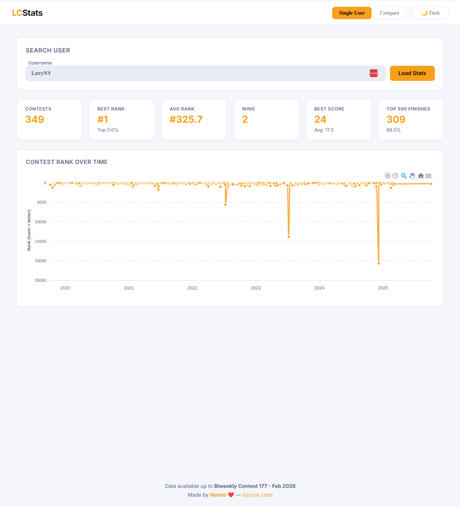
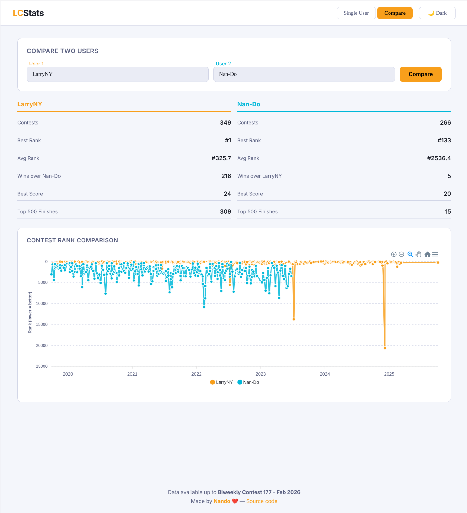

# LeetCode Contest Stats

A web application to explore and compare LeetCode contest performance. Search for any user to view their contest history, rankings, and scores — or compare two users head-to-head with interactive charts.




## Features

- **User stats** — contests played, best/avg rank, wins, best/avg score, top 500 finishes
- **Contest history chart** — interactive rank progression over time (zoom, pan, reset)
- **Head-to-head comparison** — compare two users across shared contests
- **Autocomplete search** — fast user lookup with region badges
- **Light / Dark theme** — persisted via localStorage

## Tech Stack

| Layer | Technology |
|-------|-----------|
| Runtime | Node.js (ES Modules) |
| Framework | Express.js |
| Database | SQLite (@libsql/client) |
| Frontend | Alpine.js + ApexCharts |
| Styling | Vanilla CSS with custom properties |

## Getting Started

**Install dependencies:**

```bash
npm install
```

**Run in development mode** (auto-reload on file changes):

```bash
npm run dev
```

**Run in production mode:**

```bash
npm start
```

The server starts on port `3000` by default. Open [http://localhost:3000](http://localhost:3000) in your browser.

## Configuration

| Environment Variable | Default | Description |
|---------------------|---------|-------------|
| `PORT` | `3000` | Port the server listens on |
| `DB_PATH` | `./leetcodeconteststats.db` | Path to the SQLite database file (if you want to provide your own)|

## API

| Method | Endpoint | Description |
|--------|----------|-------------|
| GET | `/api/users/search?q=<query>` | Search users by username (min 3 chars) |
| GET | `/api/user/:userSlug/stats?region=US` | Get aggregated stats for a user |
| GET | `/api/user/:userSlug/history?region=US` | Get full contest history for a user |
| GET | `/api/compare?u1=<slug>&u2=<slug>` | Compare two users head-to-head |

## Project Structure

```
├── server.js          # Express app setup and middleware
├── db.js              # Database queries
├── routes/
│   └── api.js         # API route handlers
└── public/
    ├── index.html     # Main HTML page
    ├── js/app.js      # Alpine.js frontend logic
    └── css/style.css  # Styles and theming
```

## License

MIT

---

Made by [Nando](https://github.com/Nan-Do) ❤️ — [Source code](https://github.com/Nan-Do)
