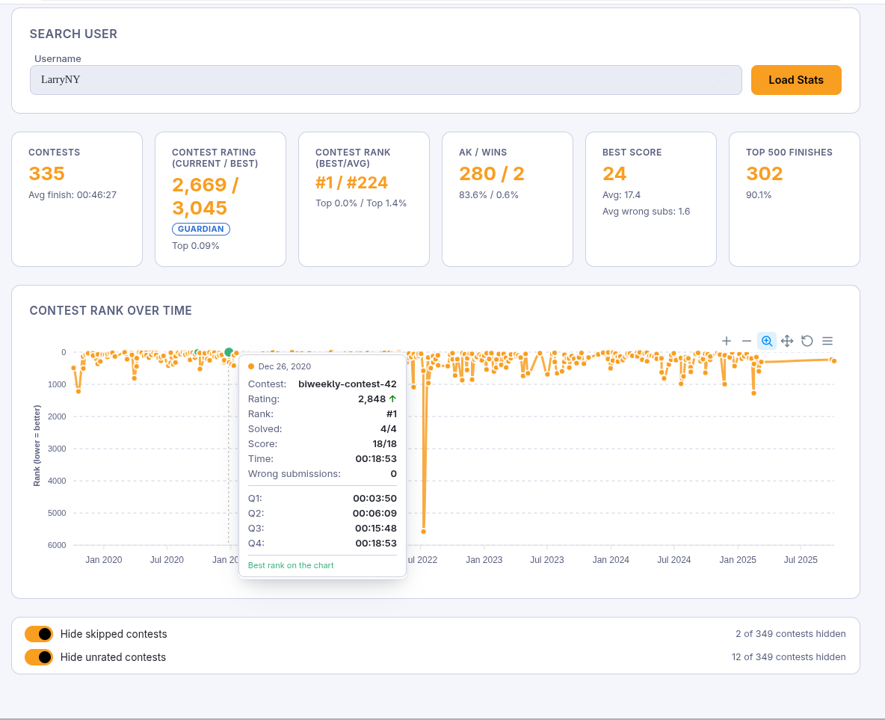
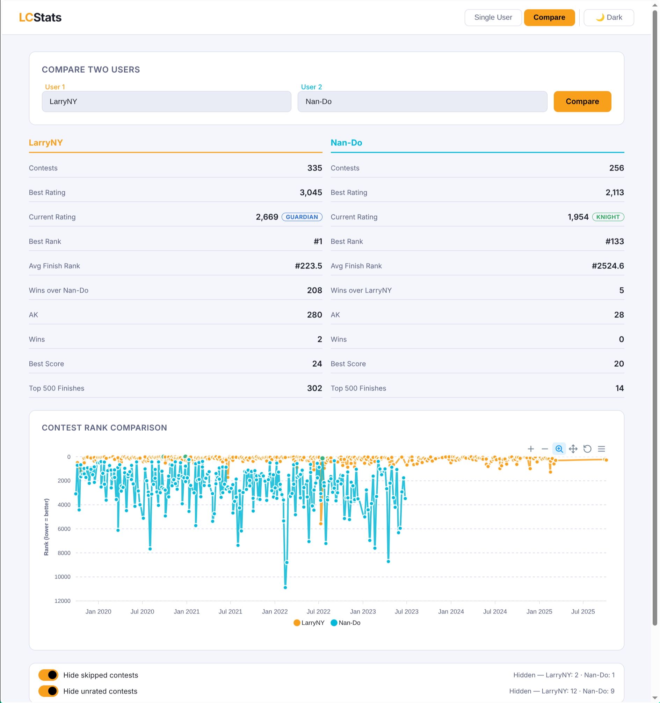

# LeetCode Contest Stats

A web application to explore and compare LeetCode contest performance. Search for any user to view their contest history, rankings, and scores — or compare two users head-to-head with interactive charts.

#### Single User Tab



#### Compare Tab



## Features

- **User stats** — contests played, best/avg rank, wins, best/avg score, top 500 finishes
- **Contest rating** — the user's LeetCode rating and Knight/Guardian badge, and the rating each contest left them on, in the chart tooltip. This comes from leetcode.com, which knows nothing about CN accounts, so those cards stay empty for them
- **Contest history chart** — interactive rank progression over time (zoom, pan, reset)
- **Per-question breakdown** — the chart tooltip marks every question a contest set, a green ✓ for solved and a red ✗ for not, so "2 of 4" also says *which* two: the easy pair, or the easy one and the hard one
- **Skipped contests filter** — registering and not turning up still scores a rank near the bottom of the field. Those contests are hidden by default, from the chart and from every figure derived from it; the switch under the chart puts them back, and remembers which way you like it
- **Unrated contests filter** — LeetCode occasionally leaves a contest unrated: the results stand, but nobody's rating moved. Those are drawn as violet squares and counted like any other contest, and the second switch takes them out of the chart and the figures for a view of the history as the rating saw it
- **Head-to-head comparison** — compare two users across shared contests
- **Autocomplete search** — fast user lookup with region badges
- **Light / Dark theme** — persisted via localStorage

## Tech Stack

| Layer | Technology |
|-------|-----------|
| Runtime | Node.js (ES Modules) |
| Framework | Express.js |
| Database | SQLite (@libsql/client) |
| Frontend | Alpine.js + ApexCharts |
| Styling | Vanilla CSS with custom properties |

## Getting Started

**Install dependencies:**

```bash
npm install
```

**Run in development mode** (auto-reload on file changes):

```bash
npm run dev
```

**Run in production mode:**

```bash
npm start
```

The server starts on port `3000` by default. Open [http://localhost:3000](http://localhost:3000) in your browser.

## Configuration

| Environment Variable | Default | Description |
|---------------------|---------|-------------|
| `PORT` | `3000` | Port the server listens on |
| `DB_PATH` | `./leetcodeconteststats.db` | Path to the SQLite database file (if you want to provide your own)|
| `TRUST_PROXY` | _(off)_ | Number of reverse proxies in front of the app. Set this when deploying behind one, so rate limiting sees the real client address instead of the proxy's. Leave unset when the app is exposed directly — otherwise a client can spoof its own address via `X-Forwarded-For`. |

## API

| Method | Endpoint | Description |
|--------|----------|-------------|
| GET | `/api/users/search?q=<query>` | Search users by username (min 3 chars) |
| GET | `/api/user/:userSlug/stats?region=US` | Get aggregated stats for a user |
| GET | `/api/user/:userSlug/history?region=US` | Get full contest history for a user |
| GET | `/api/compare?u1=<slug>&u2=<slug>` | Compare two users head-to-head |

## Project Structure

```
├── server.js          # Express app setup and middleware
├── db.js              # Database queries and the stats folded out of them
├── leetcode.js        # LeetCode's GraphQL API: ratings, and which contests it rated
├── routes/
│   └── api.js         # API route handlers
└── public/
    ├── index.html     # Main HTML page
    ├── js/app.js      # Alpine.js frontend logic
    └── css/style.css  # Styles and theming
```

## License

MIT

---
